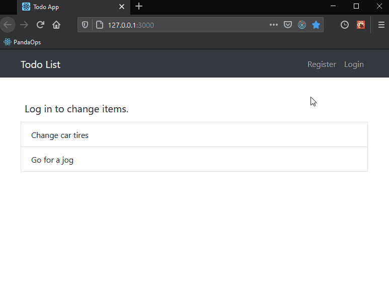

### Summary

Using [Learn The Mern Stack](https://www.youtube.com/watch?v=PBTYxXADG_k&list=PLillGF-RfqbbiTGgA77tGO426V3hRF9iE) by Traversy Media as a guide, I created this todo list web app using MongoDB, Express, React, NodeJs and Redux. I chose to work with functional components and hooks while the tutorial uses class components up to tutorial nine.

### Design Explanation

Below is a diagram I made to help describe the relationship between all of these technologies. The most challenging technology to explain in this project would have to be redux. Its implementation is somewhat chaotic, but basically you have your Redux store which contains your app's state and to change it, the action/reducer pattern is used.

Actions are javascript objects with a `type` and an optional `payload` property. Action creators are functions that return actions. To clarify, in an action creator is where you would `fetch()` data from a database, then return an object containing a label for the action - its `type`, and the data your recieved from the database - it's `payload`. The `type` can later be used to determine how the state is changed.

Reducers are functions that, given a state and action, will return a new state. I like to think of them as being analagous mathematical operations.

Above, the left hand side is the new state, the divergence (nabla dot) is the operation analagous to the action, and it's acting on the intial state.

In order to dispatch actions from a react component to a reducer, action creators and react component must be `connect()`ed together. The method used to couple action creators to react components in this app consists of passing `connect()` an object of action creators, namely `mapDispatchToProps`. Note that `connect()` is also where you choose which state properties your react component needs from the Redux store via `mapStateToProps`.

Once `connect()`ed, action creators are available to react components through their `props`. Actions are automatically dispatched to the reducer and, depending on the action `type`, can overwrite the app state.